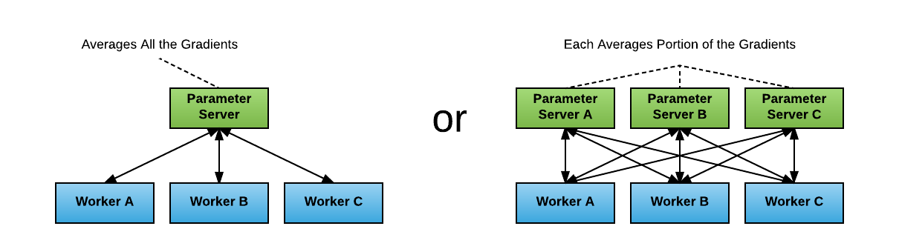

Title: 分布式 Tensorflow
Date: 2018-04-28
Category: AI
Tags: ai, tensorflow, distributed-
Slug: distributed-tensorflow
Author: X-Chu
Summary: from ps&worker to estimator and allreduce


# Tensorflow 分布式训练的各种玩儿法 - 蹭 1.8 的热度

Tensorflow 1.8 发布了！ 保持着差不多一个月一个版本，够可以的！
完整 Release Note 请移步 [Github](https://github.com/tensorflow/tensorflow/releases/tag/v1.8.0)。

抛开 Tensorflow Lite 不说，我特别关心的是这一条：

> Can now pass `tf.contrib.distribute.MirroredStrategy()` to `tf.estimator.RunConfig()`
to run an `Estimator` model on multiple GPUs on one machine

解读下：TF 高层（high level） API `Estimator` 通过 `MirroredStrategy()`
支持单机多卡分布式了（In-graph replication, all-reduce synchronous）。
我们有理由相信，后面应该会有更多的分布式策略被支持，多节点，异步，模型并行等。

而我们的目标呢，在某些场景下基于目前的机房建设肯定是多机多卡才够劲儿。
所以，今天就简单总结下，我了解的 Tensorflow 分布式训练的各种玩儿法，以及接下来会继续跟进的几个方向。

## 1. 经典 ps & worker 模式



假定大家对 Tensorflow 的一些基本[概念][tf_intro]及[架构][tf_arch]已经有所了解，在开始介绍经典模式之前，
只简单介绍下分布式涉及到的一些重点概念及策略对比：

- 模型并行 vs 数据并行

    模型并行：模型的各个部分并行于多个计算设备上；适应场景大模型，单个设备容不下；或者模型本身有比较好的并行性；

    数据并行：多个模型副本分别处理不同的训练数据，以提高整体吞吐量；是常见的分布式训练策略；

    

- `in-graph` replication vs `between-graph` replication

    `in-graph`: 图内复制，只构建一个 client 并把包含所有的 `worker` 设备都在定义一个图中，
    如果 worker 节点及设备过多，计算图过大会导致性能下降；而且只构建一个 client，数据分发的效率以及整体容错性都不好；

    `between-graph`: 图间复制，每个 `worker` 都初始化一个计算图副本， 通过 `ps`( parameter server)
    共享变量参数，只需要更新参数，免除了数据分发环节，在规模较大的情况下，相比 `in-graph` 提高了训练并行效率和容错性；

- 同步训练 vs 异步训练

    同步训练：每一次梯度更新，需要等所有的 `worker` 处理完待训练数据，先做聚会处理后再更新参数；
    优势是 loss 下降稳定；劣势是每一步的处理速度都取决于最慢的那个 `worker`；

    异步训练：各个 `worker` 的计算及模型更新都是相互独立的，没有统一控制；
    优势是速度，优化计算资源利用率；劣势是 loss 下降不稳定；

    

因为`数据同步`相比较`模型同步`具有更普适的应用场景，所以针对`数据同步`的分布式训练的支持也就更适合作为 Tensorflow 通用特性来在框架级支持。

而源于 `DistBelief` 的基于 `ps` 和 `worker` 分布式训练架构在 Tensorflow 很早的版本中便提供了支持，这也就是这里称之为 `经典` 模式的原因。

在 Tensorflow 的 `ps` 和 `worker` 模式下，`in-graph` 和 `between-graph` replication 都有支持，但是基于性能和实用性考虑，可能 `between-graph` 使用的更多一些，`同步`和`异步`则更多的是根据模型的实际效果以及项目的具体需求来选择。


### 集群描述 `tf.train.ClusterSpec`

参考：[Distributed Tensorflow](https://www.tensorflow.org/deploy/distributed)

```python
tf.train.ClusterSpec({
    "worker": [
        "worker0.example.com:2222",
        "worker1.example.com:2222",
        "worker2.example.com:2222"
    ],
    "ps": [
        "ps0.example.com:2222",
        "ps1.example.com:2222"
    ]})

# 其中， "ps" 及 "worker" 为 `job_name`, 还需要 `task_index` 来创建具体的 `tf.train.Server` 实例。
```

__注：__ 可以通过脚本或者借助调度框架来动态构建 `ClusterSpec`。

### Server 通讯协议（protocol）

* Default `grpc`
* Verbs based RDMA with `grpc+verbs`: https://github.com/tensorflow/tensorflow/tree/v1.8.0/tensorflow/contrib/verbs
* MPI with `grpc+mpi`: https://github.com/tensorflow/tensorflow/tree/v1.8.0/tensorflow/contrib/mpi
* GPU Direct RDMA with `grpc+gdr`: https://github.com/tensorflow/tensorflow/tree/v1.8.0/tensorflow/contrib/gdr

```python
server = tf.train.Server(cluster, job_name="local", task_index=0, protocol='grpc+gdr') # default protocol is 'grpc'
```

### 实践中需要留意的点

- 同步还是异步的选择
- `ps` 和 `worker` 的个数比率的调整
- `ps` 带宽占用过高时，`ps` 及 `worker` 的调度策略
- 分布式训练的状态机定义，包括终止态定义，以及当有 `worker` 训练失败后，是否支持重启训练等

## 2. 高层 API (`Estimator` 和 `Dataset`)
参考： [Tensorflow Estimator 2017][tf_2017] 及 https://medium.com/onfido-tech/higher-level-apis-in-tensorflow-67bfb602e6c0


> 注： `Experiment` 已经废弃了， 具体参考： [Github 文档][tf_learn]。

> - Remove the `experiment_fn`. Instead, create the `Estimator`,
`train_spec` and `eval_spec`, then call `tf.estimator.train_and_evaluate` directly.


`Estimator` 代表一个完整的模型。Estimator API 提供的方法包括模型的训练、评估、预测及导出。


> `Estimator` 具有下列优势：
>
> - 您可以在本地主机上或分布式多服务器环境中运行基于 `Estimator` 的模型，而无需更改模型。此外，您可以在 CPU、GPU 或 TPU 上运行基于 Estimator 的模型，而无需重新编码模型。
> - `Estimator` 简化了在模型开发者之间共享实现的过程。
> - 您可以使用高级直观代码开发先进的模型。简言之，采用 `Estimator` 创建模型通常比采用低阶 TensorFlow API 更简单。
> - `Estimator` 本身在 `tf.layers` 之上构建而成，可以简化自定义过程。
> - `Estimator` 会为您构建图。也就是说，您不必构建图。
> - `Estimator` 提供安全的分布式训练循环，可以控制如何以及何时：
>   - 构建图
>   - 初始化变量
>   - 开始排队
>   - 处理异常
>   - 创建检查点文件并从故障中恢复
>   - 保存 TensorBoard 的摘要
>
> 使用 `Estimator` 编写应用时，您必须将数据输入管道从模型中分离出来。这种分离简化了实验不同数据集的流程。

更多细节： https://www.tensorflow.org/programmers_guide/estimators


`Dataset` 是训练数据的抽象，通过 `tf.data` 下的 API 可以构建数据 pipeline，轻松处理大量数据、不同的数据格式以及复杂的转换。

- `class Dataset`: Represents a potentially large set of elements.
- `class FixedLengthRecordDataset`: A `Dataset` of fixed-length records from one or more binary files.
- `class Iterator`: Represents the state of iterating through a `Dataset`.
- `class TFRecordDataset`: A `Dataset` comprising records from one or more TFRecord files.
- `class TextLineDataset`: A `Dataset` comprising lines from one or more text files.

更多细节： https://www.tensorflow.org/programmers_guide/datasets


### 集群描述 `TF_CONFIG` 环境变量

参考：[`tf.estimator.train_and_evaluate` with `Estimator`](https://www.tensorflow.org/api_docs/python/tf/estimator/train_and_evaluate)

chief worker（必须有且只有一个）:
```python
# This should be a JSON string, which is set as environment variable. Usually
# the cluster manager handles that.
TF_CONFIG='{
    "cluster": {
        "chief": ["host0:2222"],
        "worker": ["host1:2222", "host2:2222", "host3:2222"],
        "ps": ["host4:2222", "host5:2222"]
    },
    "task": {"type": "chief", "index": 0}
}'
```

evaluator task（只有一个）:
```python
# This should be a JSON string, which is set as environment variable. Usually
# the cluster manager handles that.
TF_CONFIG='{
    "cluster": {
        "chief": ["host0:2222"],
        "worker": ["host1:2222", "host2:2222", "host3:2222"],
        "ps": ["host4:2222", "host5:2222"]
    },
    "task": {"type": "chief", "index": 0}
}'
```
__注：__ 可以通过脚本或者借助调度框架来设置 `TF_CONFIG` 。

### 实践中需要留意的点

- `Dataset` 性能： https://www.tensorflow.org/versions/master/performance/datasets_performance
- 自定义 `Estimator`: https://www.tensorflow.org/get_started/custom_estimators


## 3. Ring Allreduce

参考：[【第一期】AI Talk：TensorFlow 分布式训练的线性加速实践][horovod_zhihu]


无论是经典 ps & worker 模式，还是 High Level 的 `Estimator` API，在训练集群规模和模型较大时，
集中式的参数同步都会造成网络瓶颈。

好在 Baidu SVAIL 已经将 HPC 领域一种比较成熟的通信算法 Ring Allreduce 引入到 Deep Learning 训练框架中。

引入 Ring Allreduce 之后的拓扑变化如下：

<p>

&rarr;

</p>

### 参数更新步骤

1. 生产或者定义集群的拓扑结构

- GPU 集群被组织成一个逻辑环
- 每个 GPU 有一个左邻居、一个右邻居
- 每个 GPU 只从左邻居接受数据、并发送数据给右邻居

2. 梯度融合

- Scatter Reduce：在这个 Scatter Reduce阶段，GPU 会逐步交换彼此的梯度并融合，最后每个 GPU 都会包含完整融合梯度的一部分

- Allgather：GPU 会逐步交换彼此不完整的融合梯度，最后所有 GPU 都会得到完整的融合梯度

#### Scatter Reduce

> 为了方便说明，我们用梯度加和代替梯度融合。假设集群中有 N 个 GPU，那么将梯度数据等分为N 份，
接下来将在 GPUs 间进行 N-1 次 Scatter Reduce迭代，在每一次迭代中，每个 GPU 都会发送所有梯度数据的 1/N 给右邻居，
并从左邻居接收所有梯度数据的 1/N 。同一次 Scatter Reduce 迭代中，发送和接收的数据块的编号是不同的，
例如，第一轮迭代，第 n 个 GPU 会发送第 n 号数据块，并接收第 n-1 号数据块。经过 n-1 轮迭代，梯度数据会像图2 所示，
每个 GPU 都包含了部分完整梯度信息。

> 
> 

#### Allgather

> 和 Scatter Reduce 阶段类似，只不过这里只拷贝不求和，最终每个GPU 都得到了所有融合后的梯度。

> 
> 

#### 这么做有什么好处呢？

> 下面我们来定量的分析一下，每个 GPU 在Scatter Reduce 阶段，接收 N-1 次数据，N 是 GPU 数量；
每个 GPU 在allgather  阶段，接收 N-1 次 数据；每个 GPU 每次发送 K/N  大小数据块，K 是总数据大小；
所以，Data Transferred=2(N−1)*K/N = (2(N−1)/N)*K，随着 GPU 数量 N 增加，总传输量恒定！
总传输量恒定意味着通信成本不随 GPU 数量增长而增长，也就是说我们系统拥有理论上的线性加速能力。
再回到 DS2 的例子，300million 参数也就是 1.2Gb 数据量，Ring Allreduce 方式更新一次需要传送并接收 2.4Gb 数据，
假设网络使用 GPUDirect RDMA + InfiniBand，GPUDirect RDMA 带宽约为10Gb/s；InfiniBand 带宽约为 6Gb/s，
所以通信瓶颈在 InfiniBand 。(2.4Gb)/(6.0Gb/s) ≈ 400ms，也就是每轮迭代需要 400 ms 做参数同步，
这 400ms 的数据传输时间是恒定的，不随 GPU 数量增加而增加。

划重点： __随着设备数量 N 增加，总传输量恒定__

### Tensorflow allreduce 实践

Tensorflow 1.8 的 Release Note 说到了，单机多卡的 allreduce 可以通过 `Estimator` + `tf.contrib.distribute.MirroredStrategy()` 实现；

对于多机多卡， 来自 Uber 的开源项目 [Horovod](https://github.com/uber/horovod) 就是一个不错的选择。


## 总结

通过从经典 `ps` `worker` 模式到 `Estimator` API 封装，再到更高效的 `Ring Allreduce` 的引入，
可以看出随着 Deep Learning 需求的激增，训练框架也被朝着更快更强和更易用的方向推进。
分布式训练在大规模机器学习中是最耗时间和计算资源的哪一环，如何能有效的提高分布式训练的效率，
一定是各框架和 AI 平台提供方大家集中发力的一个点。

Ring Allreduce 只是优化分布式训练中参数同步的一个方向，通过 Horovod 的推出，我们也确实看到了几乎逼近理想的线性扩展能力，
但其实深度学习是个整体工程，一定还有其他更多方面等着大家去不断的优化。

基于容器支撑深度学习 AI 平台，可以有效的发挥容器更轻量的优势，而且镜像封装各个框架及运行环境也可以降低上手门槛，再加上像 Kubernetes
这样的容器调度平台，在提高计算资源的整合能力的同时保证整体使用率。

[kubeflow](https://github.com/kubeflow/kubeflow) 就是一个整合了基于 Kubernetes 生态圈的机器学习工具箱，
虽然目前还不算成熟，但还是朝着很不错的方向在前进，包括 tf-operator 的升级，更多框架的支持，更好的存储接入，引入工作流引擎等，
都是很有吸引力的尝试。

后面我会继续跟进 kubeflow，希望能有更多有意思的东西总结出来。

限于个人能力，这里只是简单“堆叠”了我学习 Tensorflow 分布式训练过程中的找到的一些资料和说明，如有错误，还望指出。


## Refs:
* https://zhuanlan.zhihu.com/p/35083779 "分布式 TensorFlow 入门教程"
* https://zhuanlan.zhihu.com/p/34172340 "【第一期】AI Talk：TensorFlow 分布式训练的线性加速实践"
* https://www.oreilly.com/ideas/distributed-tensorflow
* http://download.tensorflow.org/paper/whitepaper2015.pdf
* https://www.usenix.org/system/files/conference/osdi16/osdi16-abadi.pdf
* https://arxiv.org/pdf/1708.02637.pdf
* https://eng.uber.com/horovod/  "Meet Horovod: Uber’s Open Source Distributed Deep Learning Framework for TensorFlow"
* https://medium.com/onfido-tech/higher-level-apis-in-tensorflow-67bfb602e6c0 "Higher-Level APIs in TensorFlow"

[tf_intro]: https://www.tensorflow.org/programmers_guide/low_level_intro
[tf_arch]: https://www.tensorflow.org/extend/architecture
[tf_2017]: https://arxiv.org/pdf/1708.02637.pdf
[tf_learn]: https://github.com/tensorflow/tensorflow/tree/r1.8/tensorflow/contrib/learn#experiment-class---distributed-training-tooling
[horovod_zhihu]: https://zhuanlan.zhihu.com/p/34172340 "【第一期】AI Talk：TensorFlow 分布式训练的线性加速实践"
